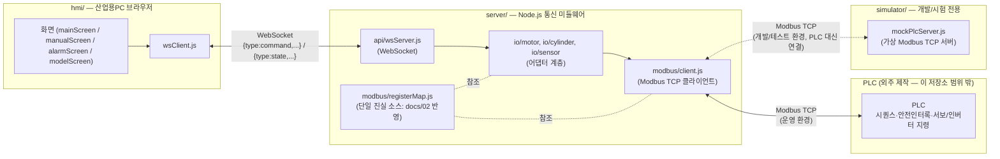
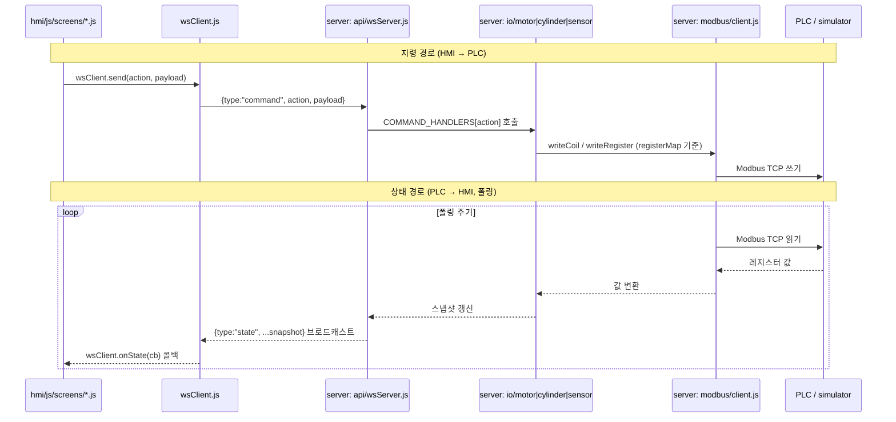
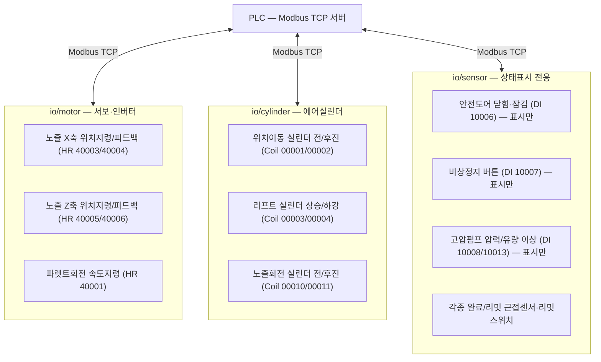

# 06. 시스템/통신 구조도

- 이 문서는 **전기 회로도(전원회로·릴레이 배선·접점 사양)가 아니다.** 그런 회로도는 PLC 자체(시퀀스·안전인터록)와 함께 **외주 제작 범위**이며, 이 저장소에는 그걸 그리는 데 필요한 정보(전원 사양, 릴레이/접촉기 스펙, 실제 배선 경로 등)가 없다 (`PROJECT_PLAN.md` §5, `CLAUDE.md` "반드시 지킬 것" 참고).
- 대신 이 문서는 **이 저장소가 실제로 담당하는 것** — HMI, Node.js 미들웨어, PLC(또는 개발 중엔 시뮬레이터) 사이의 **통신·데이터 흐름 구조**를 정리한다.
- 근거: `PROJECT_PLAN.md` 3장(폴더 구조), `docs/02_IO_태그맵.md`(레지스터), `CLAUDE.md`(HMI↔서버 포맷 규칙).

---

## 1. 물리적/네트워크 연결 구조

- HMI는 PLC와 직접 통신하지 않는다 — 항상 `server`를 거친다 (`CLAUDE.md`).
- `server`는 운영 시 실제 PLC에, 개발 시 `simulator`에 **같은 Modbus TCP 클라이언트 코드**로 접속한다 (접속 대상 IP/포트만 `plcConfig.js` / `mockPlcServer.js`에서 다름 — 두 파일 별도 관리, 자동 동기화 안 됨).
- PLC 내부에서 서보드라이버·인버터와 어떻게 통신하는지(펄스열/통신 등)는 PLC업체 구현 세부사항이며 이 구조도 범위 밖 (`docs/02_IO_태그맵.md` 아키텍처 확정 메모 참고).

---

## 2. 소프트웨어 데이터 흐름 (명령 → 상태 왕복)

- HMI→서버는 `{type:"command", action, payload}`, 서버→HMI는 `{type:"state", ...snapshot}` — 이 포맷은 임의로 바꾸지 않는다 (`CLAUDE.md`).
- 화면 코드(`screens/*.js`)는 WebSocket을 직접 만지지 않고 `wsClient.js`만 거친다.
- 상태 판단(사이클 진행, 안전정지)은 PLC가 하고, `stateMachine.js`는 PLC가 발행한 값을 **미러링만** 한다 (`03_공정시퀀스.md`).

---

## 3. I/O 신호 그룹 개념도 (`docs/02_IO_태그맵.md` 기준)

- 여기 표시된 신호명·주소는 `docs/02_IO_태그맵.md`의 **제안 주소**이며 최종 확정판이 아니다. 이 개념도가 태그맵과 어긋나면 태그맵을 따른다(단일 진실 소스).
- 안전도어·비상정지·펌프 이상신호는 PLC/하드와이어드가 직접 판단·차단하고, 이 프로그램은 **상태 표시**만 한다 — 화살표가 있다고 해서 이 프로그램이 안전판단을 대신한다는 뜻이 아니다.

---

## 4. 이 문서로 대체할 수 없는 것

아래는 실제 전기설계 도면이 필요한 영역이며, PLC 발주 사양서·PLC업체 도면으로 확인해야 한다 (`docs/04_확인필요사항.md` 참고):
- 전원회로(메인 차단기, 전자접촉기, 과부하 보호)
- 비상정지·도어인터록의 실제 배선(NC/NO 접점 방식, 이중화 구성)
- 릴레이/접촉기 정격, 케이블 사양
- PLC 내부의 서보드라이버·인버터 배선

이 항목들은 이 저장소의 코드나 문서로 임의 확정하지 않는다.
